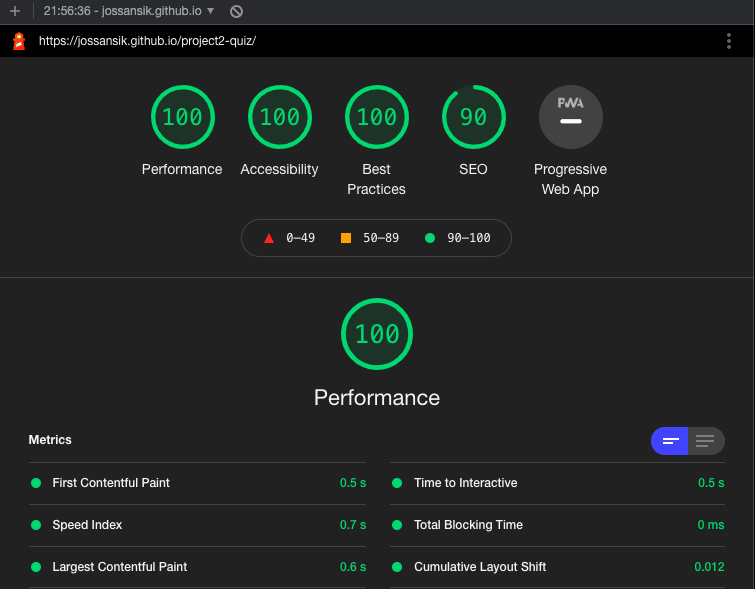

# Royal Quiz

The intention of the webpage is to provide a quick and educational game in which players attempt to answer questions correctly about the Swedish monarchy. 

Each quiz question has four answer option for the player to choose from. 

It can be used for entertainment and learning and to measure the player's knowledge on the subject. 

## Features

### Start view
The start view features a simple design consisting of: 

Header "QUIZ" & text - "Test your knowledge about the Swedish monarchy"

Image of a queen.

A green button with text - "START QUIZ". 

When "START QUIZ"-button is clicked, the player is taken to the game view.

### Game view
The game view follows the same design as the start view. 

It features a header which notes what question the player is on and a question.

Under the question there is four different answer option-buttons & next to each button there is a different icon associated with royalty.

When an option is chosen the button will either turn green (if correct answer), or red (if wrong answer), and the text inside will turn white. An icon next to the answer option shows a check symbol for the right one, and a x symbol if the chosen option is wrong.

Before an option is chosen, the "next question"-button is disabled and has a dark olive green color.

After an option is chosen, the "next question"-button is clickable and has a dark green color.

On the last question, instead of "next question", the button will say "show result". By clicking this button the player is taken to the result view.

### Result view
The result view follows the same design as the start and game view. 

A text states the player's number of correctly answered questions. 

A pie chart displays the percentage distribution between right and wrong answers.

A button - "Try again" reloads the page on click and takes the player back to the starting view.
  

## Testing

The website works in the following browsers:
Chrome, Firefox, Safari.
The project is responsive, functional and looks good in all of the standard screen sizes available in devtools.

## Validator testing
No errors were returned when passing through the official W3C validator. 

No errors were returned when passing through the official (Jigsaw) validator. 

No significant issues returned when passing through the jshint.com linter. 

## Accessibility
I confirmed that the colors and fonts chosen are easy to read and accessible by running it through lighthouse in devtools.

## Deployment
The site was deployed to GitHub Pages (GitHub repository > settings, select branch main and click save). 

The live link can be found [here](https://jossansik.github.io/project2-quiz/)

## Credits

The royal icons were taken from thenounproject.com. 

The icons for marking correct and incorrect answers were taken from fontawesome.

The information in the questions and correct answers was found on Wikipedia and in the book "The Reluctant Monarch".

The pie chart is using Google Chart.

